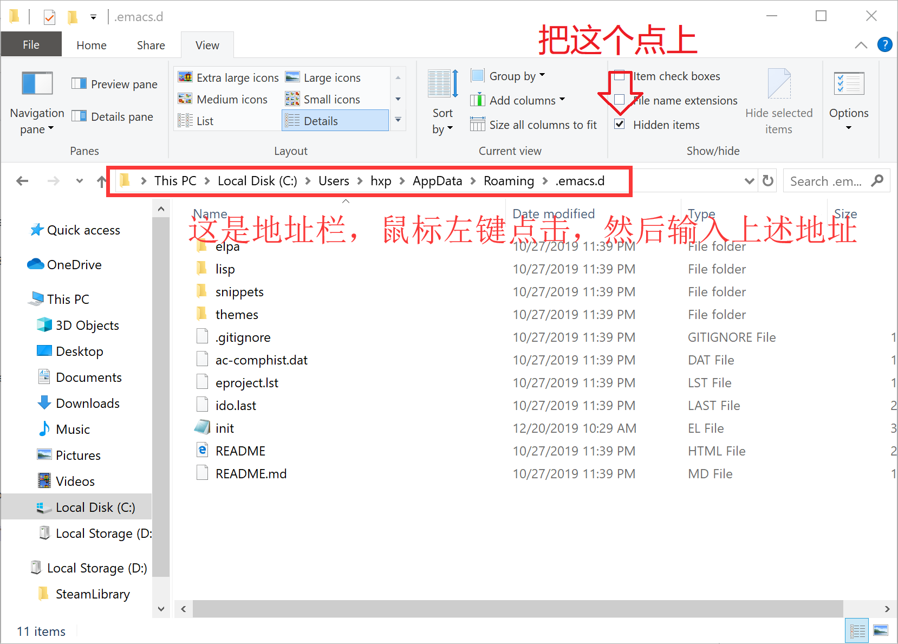

# Emacs 26.3 Win10 64位 安装指南

# 从GNU的FTP服务器下载Emacs

[按住Ctrl点击这里下载](http://gnu.mirrors.hoobly.com/emacs/windows/emacs-26/emacs-26.3-x86_64.zip)

下载完成后解压（右键，解压到"emacs-26.3-x86_64/*"）,解压得到的文件夹可以放在任意目录下

就安装完成了

# 运行Emacs

进入刚刚解压到的文件夹，运行bin目录里的runemacs.exe

# 导入我的Emacs配置文件

先运行Emacs然后退出

之后进入`C:\Users\<你的用户名>\AppData\Roaming\.emacs.d`,如果里面有文件，全部删除。

简便方法：将`C:\Users\%USERNAME%\AppData\Roaming\.emacs.d`输入到Windows资源管理器的地址栏，回车

**点懒人包里面的快捷方式也行**

把[我GitHub上的Windows下Emacs配置文件](https://github.com/XipingHu/Emacs-LaTeX-for-Win10)下载，直接Download Zip，之后解压，把`.emacs.d`文件夹下所有文件放到上述目录，并检查上一级目录`C:\Users\<你的用户名>\AppData\Roaming`中有没有`.emacs`，如果有，就删除。

我的预览功能需要配合Sumatra PDF来进行预览

[按住Ctrl然后点击下载Sumatra PDF安装程序](https://www.sumatrapdfreader.org/dl/SumatraPDF-3.1.2-64-install.exe)

下载完成后若使用`C-c C-v`的预览功能，需选择Sumatra PDF来预览才能正常运作

**记得加环境变量`c:/Program Files/SumatraPDF`到 `PATH`**

我的拼写检查功能需要安装hunspell

[安装Msys2](https://github.com/XipingHu/Msys2-Win10-Install-Guide)，之后再Msys2中执行:

`pacman -S  mingw-w64-x86_64-hunspell mingw-w64-x86_64-hunspell-en`

**注意：如果你的Msys2没有安装在默认的C盘，或者不是64位，请编辑Emacs配置文件里的init.el**

Windows搜索框输入`env`编辑环境变量

